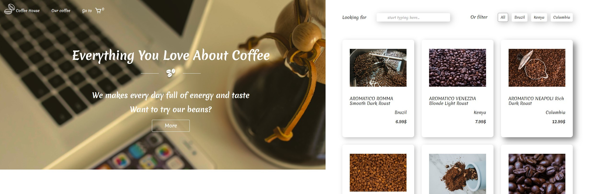

<!-- PROJECT LOGO -->
<br />
<div align="center">
  

  <h1 align="center">Coffee Shop</h1>

  <p align="center">
    Coffee shop application
	<br/>
	<a href="https://coffee-shop-two-mu.vercel.app/">View Demo</a>
  </p>
</div>


<!-- ABOUT THE PROJECT -->
## About The Project

<div align="center">
  <span>
    
   </span>
</div>

The application consists of the main page, the coffee shop page, and the cart page.

Features: 
* You can filter coffee by country of origin or search by title;
* You can add coffee to the cart;
* A chosen coffee are displayed at the cart page, you can add more, remove coffee from the cart.


### Built With

* ReactJS, React Hooks
* React-router
* Redux Toolkit
* JavaScript
* HTML, CSS


<!-- GETTING STARTED -->
### Installation

1. Clone the repo
   ```sh
   git clone https://github.com/Regina5425/coffee-shop.git
   ```
2. Install NPM packages
   ```sh
   npm install
   ```
3. Run the app on your localhost
   ```js
   npm start
   ```

<!-- CONTACT -->
## Contact

E-mail: reina5425@gmail.com
